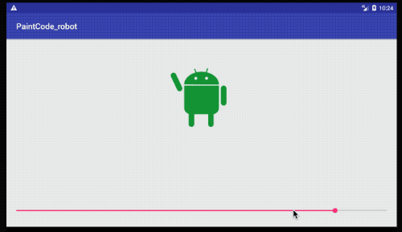

# PaintCode animation tutorial (Android)

An implementation of the Android tutorial at:
https://www.paintcodeapp.com/tutorials

The main point is that you can add variables in your paintCode drawing, and change their value in your app to animate the drawing.

